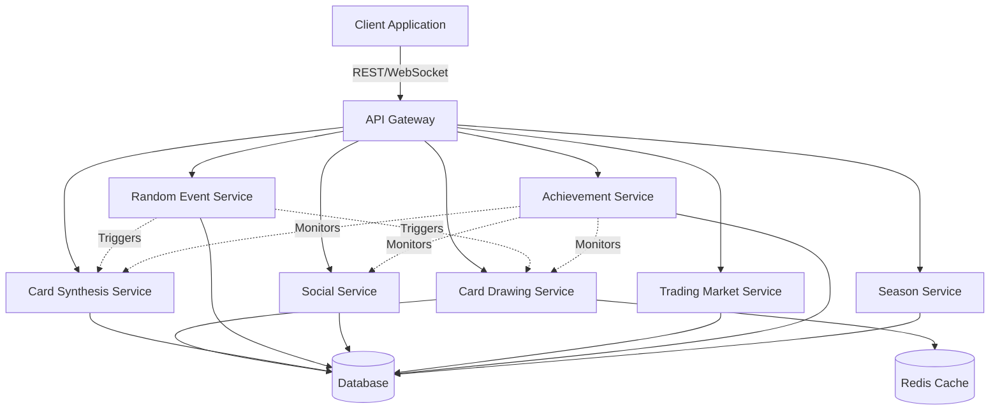

# Design Document: Card Mystery Realm

## Overview

Card Mystery Realm is a psychologically-driven card collection game that combines gacha mechanics, synthesis systems, random events, and social features to create an engaging player experience. The system leverages variable reinforcement schedules, near-miss effects, social comparison, and sunk cost principles to maximize engagement and retention.

The architecture follows a client-server model with real-time synchronization, deterministic random number generation, and server-side validation to ensure data integrity and prevent manipulation. The client handles rich 3D animations, particle effects, and physics simulations using Three.js, GSAP, and Ammo.js, while the server manages game logic, probability calculations, and persistent state.

### Key Design Principles

1. **Server Authority**: All game-affecting operations (draws, synthesis, trades) are validated and executed server-side
2. **Deterministic Randomness**: Random outcomes use synchronized seeds to enable client prediction while maintaining server verification
3. **Real-time Synchronization**: Player state, leaderboards, and social features update in real-time using database subscriptions
4. **Psychological Engagement**: System design incorporates variable reinforcement, near-miss effects, and social comparison mechanics
5. **Extensibility**: Configuration-driven systems allow probability adjustments and content updates without code changes

## Architecture

### System Components

The system consists of the following major components:




### Component Responsibilities


**Card Drawing Service**
- Manages pack purchases and card generation
- Implements probability distributions and pity systems
- Tracks and applies luck value modifiers
- Generates near-miss animations
- Validates purchases and updates player inventory

**Card Synthesis Service**
- Processes card combination requests
- Calculates success probabilities with event modifiers
- Validates input cards and consumes them atomically
- Generates output cards on success
- Tracks failure counts for protection mechanics

**Random Event Service**
- Triggers events based on player actions
- Manages event timers and active states
- Applies temporary modifiers to other systems
- Distributes event rewards
- Loads and validates event configurations

**Social Service**
- Manages player galleries and card displays
- Processes likes, comments, and social interactions
- Calculates and updates leaderboard rankings
- Provides friend recommendations
- Distributes social rewards

**Trading Market Service**
- Lists cards for sale with player-specified prices
- Processes purchase transactions atomically
- Tracks transaction history for price trends
- Calculates dynamic pricing suggestions
- Manages limited edition card metadata

**Achievement Service**
- Monitors player actions across all systems
- Tracks progress toward achievement goals
- Unlocks achievements and distributes rewards
- Manages hidden achievement discovery
- Provides achievement progress queries

**Season Service**
- Manages seasonal content cycles
- Tracks battle pass progression
- Generates and validates daily/weekly missions
- Distributes login rewards and streak tracking
- Handles season transitions and archival

## Components and Interfaces

### API Design

The system exposes RESTful APIs for stateless operations and WebSocket connections for real-time updates.


#### Card Drawing API

```typescript
// Purchase and draw cards from a pack
POST /api/v1/cards/draw
Request: {
  packType: 'basic' | 'premium' | 'legendary',
  quantity: number,
  currencyType: 'soft' | 'hard'
}
Response: {
  cards: Card[],
  newLuckValue: number,
  nearMissCards?: Card[],
  guaranteedDropTriggered: boolean,
  transactionId: string
}

// Get current pack configurations
GET /api/v1/cards/packs
Response: {
  packs: PackConfiguration[]
}

// Get player's current luck value (for debugging/admin)
GET /api/v1/cards/luck
Response: {
  luckValue: number,
  drawsSinceLastLegendary: number
}
```

#### Card Synthesis API

```typescript
// Attempt card synthesis
POST /api/v1/synthesis/combine
Request: {
  synthesisType: 'normal' | 'advanced' | 'gambler' | 'legendary',
  inputCardIds: string[],
  materialIds?: string[]
}
Response: {
  success: boolean,
  outputCard?: Card,
  consumedCards: string[],
  failureCount: number,
  protectionActive: boolean
}

// Get synthesis success rates (with active modifiers)
GET /api/v1/synthesis/rates
Response: {
  rates: {
    normal: number,
    advanced: number,
    gambler: number,
    legendary: number
  },
  activeModifiers: EventModifier[]
}
```


#### Random Event API

```typescript
// Trigger event check (called on player actions)
POST /api/v1/events/trigger
Request: {
  actionType: string,
  context: Record<string, any>
}
Response: {
  eventTriggered: boolean,
  event?: {
    type: 'merchant' | 'storm' | 'lucky' | 'copy',
    duration?: number,
    rewards?: any,
    offers?: any
  }
}

// Get active events for player
GET /api/v1/events/active
Response: {
  activeEvents: ActiveEvent[]
}

// Accept event offer (for merchant events)
POST /api/v1/events/accept
Request: {
  eventId: string,
  offerId: string
}
Response: {
  success: boolean,
  rewards?: any
}
```

#### Social API

```typescript
// Update player gallery
PUT /api/v1/social/gallery
Request: {
  cardIds: string[] // max 50
}
Response: {
  success: boolean,
  gallery: Gallery
}

// Get friend's gallery
GET /api/v1/social/gallery/:playerId
Response: {
  gallery: Gallery,
  canLike: boolean,
  hasLikedToday: boolean
}

// Like a gallery
POST /api/v1/social/gallery/:playerId/like
Response: {
  success: boolean,
  rewardGranted: number
}

// Comment on gallery
POST /api/v1/social/gallery/:playerId/comment
Request: {
  text: string
}
Response: {
  success: boolean,
  comment: Comment,
  rewardGranted: number
}

// Get leaderboards
GET /api/v1/social/leaderboards
Query: {
  type: 'total_score' | 'rarity_score' | 'creativity',
  limit: number,
  offset: number
}
Response: {
  rankings: LeaderboardEntry[]
}
```


#### Trading Market API

```typescript
// List card for sale
POST /api/v1/market/list
Request: {
  cardId: string,
  price: number,
  currencyType: 'soft' | 'hard'
}
Response: {
  listingId: string,
  listing: MarketListing
}

// Purchase card from market
POST /api/v1/market/purchase
Request: {
  listingId: string
}
Response: {
  success: boolean,
  card: Card,
  transactionFee: number
}

// Get market listings
GET /api/v1/market/listings
Query: {
  rarity?: string,
  sortBy: 'price' | 'recent' | 'popular',
  limit: number,
  offset: number
}
Response: {
  listings: MarketListing[],
  priceStats: PriceStatistics
}

// Get price trends
GET /api/v1/market/trends/:cardId
Response: {
  averagePrice: number,
  priceHistory: PricePoint[],
  suggestedPrice: number,
  supply: number,
  demand: number
}
```

#### Achievement API

```typescript
// Get player achievements
GET /api/v1/achievements
Response: {
  achievements: Achievement[],
  unlockedCount: number,
  totalCount: number
}

// Get achievement progress
GET /api/v1/achievements/:achievementId
Response: {
  achievement: Achievement,
  progress: number,
  maxProgress: number,
  unlocked: boolean
}
```


#### Season API

```typescript
// Get current season info
GET /api/v1/season/current
Response: {
  season: Season,
  battlePass: BattlePassProgress,
  daysRemaining: number
}

// Get daily/weekly missions
GET /api/v1/season/missions
Response: {
  dailyMissions: Mission[],
  weeklyMissions: Mission[],
  resetTimes: {
    daily: string,
    weekly: string
  }
}

// Claim mission reward
POST /api/v1/season/missions/:missionId/claim
Response: {
  success: boolean,
  rewards: Reward[],
  newBattlePassXP: number
}

// Get login rewards
GET /api/v1/season/login-rewards
Response: {
  consecutiveDays: number,
  todaysClaimed: boolean,
  nextReward: Reward
}

// Claim login reward
POST /api/v1/season/login-rewards/claim
Response: {
  success: boolean,
  reward: Reward,
  newStreak: number
}
```

#### WebSocket Events

```typescript
// Real-time leaderboard updates
ws://api/v1/ws/leaderboards
Message: {
  type: 'leaderboard_update',
  leaderboardType: string,
  rankings: LeaderboardEntry[]
}

// Real-time gallery updates
ws://api/v1/ws/gallery/:playerId
Message: {
  type: 'gallery_update' | 'new_like' | 'new_comment',
  data: any
}

// Event notifications
ws://api/v1/ws/events
Message: {
  type: 'event_triggered' | 'event_expired',
  event: ActiveEvent
}
```

## Data Models


### Core Entities

#### Card

```typescript
interface Card {
  id: string;                    // Unique card instance ID
  templateId: string;            // Card template/type ID
  name: string;
  description: string;
  rarity: 'common' | 'rare' | 'epic' | 'legendary';
  theme: string;                 // For personalization tracking
  imageUrl: string;
  animationUrl?: string;
  score: number;                 // Base score for leaderboards
  
  // Limited edition metadata
  isLimitedEdition: boolean;
  editionNumber?: number;        // e.g., #42 of 1000
  originalOwner?: string;        // Player ID of first owner
  ownershipHistory?: OwnershipRecord[];
  
  // Timestamps
  obtainedAt: string;
  obtainedFrom: 'draw' | 'synthesis' | 'trade' | 'event' | 'achievement';
}

interface OwnershipRecord {
  playerId: string;
  playerName: string;
  acquiredAt: string;
  acquiredFrom: 'draw' | 'trade' | 'synthesis';
}
```

#### Player

```typescript
interface Player {
  id: string;
  username: string;
  email: string;
  
  // Currencies
  softCurrency: number;          // Coins
  hardCurrency: number;          // Premium currency
  
  // Card collection
  cards: string[];               // Card IDs
  galleryCardIds: string[];      // Up to 50 cards for display
  
  // Progression
  level: number;
  experience: number;
  battlePassLevel: number;
  battlePassXP: number;
  hasPaidBattlePass: boolean;
  
  // Psychological mechanics
  luckValue: number;             // Hidden luck accumulator
  drawsSinceLastLegendary: number;
  consecutiveSynthesisFailures: number;
  
  // Engagement tracking
  consecutiveLoginDays: number;
  lastLoginDate: string;
  totalPlayTime: number;
  
  // Personalization data
  preferredThemes: string[];
  collectionFocus: string[];
  
  // Social
  friends: string[];             // Player IDs
  
  // Limits and cooldowns
  legendaryPacksThisWeek: number;
  weekResetDate: string;
  
  // Timestamps
  createdAt: string;
  lastActiveAt: string;
}
```


#### PackConfiguration

```typescript
interface PackConfiguration {
  id: string;
  name: string;
  type: 'basic' | 'premium' | 'legendary';
  cost: number;
  currencyType: 'soft' | 'hard';
  
  // Probability distribution
  probabilities: {
    legendary: number;           // e.g., 0.005 for 0.5%
    epic: number;
    rare: number;
    common: number;
  };
  
  // Pity system
  guaranteedEpicAfter?: number;  // e.g., 10 draws
  guaranteedLegendaryAfter?: number;
  
  // Limits
  purchaseLimit?: number;        // Per week
  limitResetPeriod?: 'daily' | 'weekly' | 'monthly';
  
  // Availability
  availableFrom?: string;        // ISO date
  availableUntil?: string;       // ISO date for limited packs
  seasonExclusive?: boolean;
}
```

#### SynthesisRecipe

```typescript
interface SynthesisRecipe {
  type: 'normal' | 'advanced' | 'gambler' | 'legendary';
  
  // Input requirements
  requiredCards: {
    count: number;
    mustBeIdentical: boolean;
    rarityRequirement?: string;
  };
  requiredMaterials?: {
    materialId: string;
    count: number;
  }[];
  
  // Output
  outputRarity: string;
  baseSuccessRate: number;       // 0.0 to 1.0
  
  // Costs
  softCurrencyCost?: number;
}
```

#### ActiveEvent

```typescript
interface ActiveEvent {
  id: string;
  playerId: string;
  eventType: 'merchant' | 'storm' | 'lucky' | 'copy';
  
  // Timing
  triggeredAt: string;
  expiresAt?: string;            // For timed events like Lucky Moment
  
  // Event-specific data
  merchantOffers?: MerchantOffer[];
  stormDrawsRemaining?: number;
  luckyMomentBonus?: number;     // e.g., 0.2 for 20%
  copiedCard?: Card;
  
  // State
  claimed: boolean;
}

interface MerchantOffer {
  id: string;
  itemType: 'pack' | 'material' | 'card';
  itemId: string;
  price: number;
  currencyType: 'soft' | 'hard';
  discount: number;              // Percentage
}
```


#### Gallery

```typescript
interface Gallery {
  playerId: string;
  cardIds: string[];             // Max 50
  
  // Social metrics
  totalLikes: number;
  totalComments: number;
  
  // Scores for leaderboards
  totalScore: number;            // Sum of card scores
  rarityScore: number;           // Weighted by rarity
  creativityScore: number;       // Based on likes + comments
  
  // Customization
  skinId?: string;               // Cosmetic gallery skin
  layout?: string;               // Display layout preference
  
  updatedAt: string;
}

interface GalleryInteraction {
  id: string;
  galleryPlayerId: string;
  interactingPlayerId: string;
  type: 'like' | 'comment';
  
  // For comments
  text?: string;
  
  createdAt: string;
}
```

#### MarketListing

```typescript
interface MarketListing {
  id: string;
  sellerId: string;
  sellerName: string;
  
  card: Card;
  price: number;
  currencyType: 'soft' | 'hard';
  
  // Market data
  views: number;
  
  listedAt: string;
  expiresAt?: string;
  soldAt?: string;
  buyerId?: string;
}

interface PriceStatistics {
  cardTemplateId: string;
  averagePrice: number;
  medianPrice: number;
  lowestPrice: number;
  highestPrice: number;
  totalListings: number;
  recentSales: number;          // Last 24 hours
  priceChange24h: number;       // Percentage
}
```


#### Achievement

```typescript
interface Achievement {
  id: string;
  name: string;
  description: string;
  category: 'collection' | 'rarity' | 'social' | 'random' | 'secret';
  
  // Unlock conditions
  requirement: {
    type: string;                // e.g., 'complete_series', 'legendary_count'
    target: number;
    params?: Record<string, any>;
  };
  
  // Rewards
  rewards: {
    softCurrency?: number;
    hardCurrency?: number;
    exclusiveCard?: string;
    title?: string;
  };
  
  // Display
  iconUrl: string;
  isSecret: boolean;             // Hide conditions until unlocked
  
  // Player-specific state (when queried for a player)
  unlocked?: boolean;
  progress?: number;
  unlockedAt?: string;
}
```

#### Season

```typescript
interface Season {
  id: string;
  name: string;
  theme: string;
  
  // Timing
  startDate: string;
  endDate: string;
  
  // Content
  exclusiveCardTemplates: string[];
  exclusivePacks: string[];
  
  // Battle pass
  battlePassTiers: BattlePassTier[];
  
  // Events
  scheduledEvents: ScheduledEvent[];
}

interface BattlePassTier {
  level: number;
  xpRequired: number;
  
  freeRewards: Reward[];
  paidRewards: Reward[];
}

interface Reward {
  type: 'soft_currency' | 'hard_currency' | 'card' | 'pack' | 'material' | 'cosmetic';
  itemId?: string;
  quantity: number;
}

interface ScheduledEvent {
  name: string;
  type: 'double_probability' | 'synthesis_festival' | 'special_merchant';
  startDate: string;
  endDate: string;
  modifiers: Record<string, any>;
}
```


#### Mission

```typescript
interface Mission {
  id: string;
  type: 'daily' | 'weekly';
  
  name: string;
  description: string;
  
  // Requirements
  objective: {
    type: string;                // e.g., 'draw_cards', 'synthesize', 'trade'
    target: number;
    params?: Record<string, any>;
  };
  
  // Rewards
  rewards: Reward[];
  battlePassXP: number;
  
  // Player-specific state
  progress?: number;
  completed?: boolean;
  claimed?: boolean;
  
  // Timing
  availableFrom: string;
  expiresAt: string;
}
```

### Database Schema

The system uses a document-based database (e.g., Firebase Firestore, MongoDB) with the following collections:

```
/players/{playerId}
  - Player document with all player data
  
/cards/{cardId}
  - Card instance documents
  - Indexed by: playerId, templateId, rarity, obtainedAt
  
/card_templates/{templateId}
  - Card template definitions (immutable)
  
/pack_configurations/{packId}
  - Pack definitions and probabilities
  
/galleries/{playerId}
  - Gallery documents
  - Indexed by: totalScore, rarityScore, creativityScore
  
/gallery_interactions/{interactionId}
  - Likes and comments
  - Indexed by: galleryPlayerId, interactingPlayerId, createdAt
  
/market_listings/{listingId}
  - Active market listings
  - Indexed by: cardTemplateId, price, listedAt
  
/market_transactions/{transactionId}
  - Historical transaction records
  - Indexed by: cardTemplateId, timestamp
  
/achievements/{achievementId}
  - Achievement definitions
  
/player_achievements/{playerId}/achievements/{achievementId}
  - Player-specific achievement progress
  
/seasons/{seasonId}
  - Season definitions
  
/active_events/{eventId}
  - Currently active events
  - Indexed by: playerId, eventType, expiresAt
  
/missions/{missionId}
  - Mission definitions
  
/player_missions/{playerId}/missions/{missionId}
  - Player-specific mission progress
```


### Technical Implementation Details

#### Luck Value System

The luck value system implements a hidden pity mechanism that increases legendary drop rates after unsuccessful attempts:

```typescript
class LuckValueCalculator {
  private readonly INCREMENT_PER_DRAW = 1.0;
  private readonly THRESHOLD = 50.0;
  private readonly MAX_BONUS = 0.05;  // 5% max bonus
  
  calculateBonusProbability(luckValue: number): number {
    if (luckValue < this.THRESHOLD) {
      return 0;
    }
    
    const excessLuck = luckValue - this.THRESHOLD;
    const bonus = Math.min(
      (excessLuck / this.THRESHOLD) * this.MAX_BONUS,
      this.MAX_BONUS
    );
    
    return bonus;
  }
  
  updateLuckValue(
    currentLuck: number,
    drewLegendary: boolean
  ): number {
    if (drewLegendary) {
      return 0;
    }
    return currentLuck + this.INCREMENT_PER_DRAW;
  }
}
```

#### Deterministic Random Number Generation

To enable client-side prediction while maintaining server authority, the system uses seeded random number generators:

```typescript
class SeededRandom {
  private seed: number;
  
  constructor(seed: number) {
    this.seed = seed;
  }
  
  next(): number {
    // Linear congruential generator
    this.seed = (this.seed * 1103515245 + 12345) & 0x7fffffff;
    return this.seed / 0x7fffffff;
  }
  
  nextInRange(min: number, max: number): number {
    return min + this.next() * (max - min);
  }
}

// Usage for card draws
function generateCardDraw(
  packConfig: PackConfiguration,
  playerLuck: number,
  serverSeed: number
): Card {
  const rng = new SeededRandom(serverSeed);
  const roll = rng.next();
  
  // Apply luck bonus
  const luckBonus = new LuckValueCalculator()
    .calculateBonusProbability(playerLuck);
  
  const adjustedProbs = {
    legendary: packConfig.probabilities.legendary + luckBonus,
    epic: packConfig.probabilities.epic,
    rare: packConfig.probabilities.rare,
    common: packConfig.probabilities.common
  };
  
  // Normalize probabilities
  const total = Object.values(adjustedProbs)
    .reduce((sum, p) => sum + p, 0);
  
  Object.keys(adjustedProbs).forEach(key => {
    adjustedProbs[key] /= total;
  });
  
  // Determine rarity
  let cumulative = 0;
  let selectedRarity = 'common';
  
  for (const [rarity, prob] of Object.entries(adjustedProbs)) {
    cumulative += prob;
    if (roll <= cumulative) {
      selectedRarity = rarity;
      break;
    }
  }
  
  // Select random card of that rarity
  return selectRandomCardOfRarity(selectedRarity, rng);
}
```


#### Near-Miss Effect Implementation

Near-miss animations show rare cards that don't actually drop to create psychological engagement:

```typescript
class NearMissGenerator {
  private readonly NEAR_MISS_PROBABILITY = 0.15;  // 15% chance
  
  shouldShowNearMiss(
    actualRarity: string,
    rng: SeededRandom
  ): boolean {
    // Only show near-miss for common/rare draws
    if (actualRarity === 'legendary' || actualRarity === 'epic') {
      return false;
    }
    
    return rng.next() < this.NEAR_MISS_PROBABILITY;
  }
  
  generateNearMissCard(
    actualRarity: string,
    rng: SeededRandom
  ): Card {
    // Show a card one rarity higher
    const nearMissRarity = actualRarity === 'common' ? 'rare' : 'epic';
    return selectRandomCardOfRarity(nearMissRarity, rng);
  }
}

// Animation sequence
async function playCardRevealAnimation(
  actualCard: Card,
  nearMissCard?: Card
): Promise<void> {
  if (nearMissCard) {
    // Show near-miss card briefly
    await showCard(nearMissCard, { duration: 500 });
    await flashTransition({ duration: 200 });
  }
  
  // Show actual card
  await showCard(actualCard, { 
    duration: 2000,
    particles: actualCard.rarity === 'legendary'
  });
}
```

#### Synthesis Success Calculation

```typescript
class SynthesisCalculator {
  calculateSuccessRate(
    recipe: SynthesisRecipe,
    activeEvents: ActiveEvent[],
    failureCount: number
  ): number {
    let rate = recipe.baseSuccessRate;
    
    // Apply Lucky Moment bonus
    const luckyEvent = activeEvents.find(e => e.eventType === 'lucky');
    if (luckyEvent) {
      rate += luckyEvent.luckyMomentBonus;
    }
    
    // Apply failure protection
    if (failureCount >= 3) {
      rate += 0.10;  // 10% bonus after 3 failures
    }
    
    return Math.min(rate, 1.0);  // Cap at 100%
  }
  
  performSynthesis(
    recipe: SynthesisRecipe,
    successRate: number,
    rng: SeededRandom
  ): boolean {
    return rng.next() < successRate;
  }
}
```


#### Event Triggering System

```typescript
class EventTriggerSystem {
  private eventConfigs: Map<string, EventConfiguration>;
  
  checkForEvent(
    actionType: string,
    player: Player,
    rng: SeededRandom
  ): ActiveEvent | null {
    const roll = rng.next();
    let cumulative = 0;
    
    // Check each event type
    for (const [eventType, config] of this.eventConfigs) {
      cumulative += config.probability;
      
      if (roll <= cumulative) {
        return this.createEvent(eventType, config, player);
      }
    }
    
    return null;
  }
  
  private createEvent(
    eventType: string,
    config: EventConfiguration,
    player: Player
  ): ActiveEvent {
    const now = new Date();
    
    switch (eventType) {
      case 'merchant':
        return {
          id: generateId(),
          playerId: player.id,
          eventType: 'merchant',
          triggeredAt: now.toISOString(),
          merchantOffers: this.generateMerchantOffers(),
          claimed: false
        };
        
      case 'storm':
        return {
          id: generateId(),
          playerId: player.id,
          eventType: 'storm',
          triggeredAt: now.toISOString(),
          stormDrawsRemaining: 3,
          claimed: false
        };
        
      case 'lucky':
        const expiresAt = new Date(now.getTime() + 10 * 60 * 1000);
        return {
          id: generateId(),
          playerId: player.id,
          eventType: 'lucky',
          triggeredAt: now.toISOString(),
          expiresAt: expiresAt.toISOString(),
          luckyMomentBonus: 0.20,
          claimed: false
        };
        
      case 'copy':
        const randomCard = this.selectRandomCard(player.cards);
        return {
          id: generateId(),
          playerId: player.id,
          eventType: 'copy',
          triggeredAt: now.toISOString(),
          copiedCard: randomCard,
          claimed: false
        };
    }
  }
}
```

## Correctness Properties

*A property is a characteristic or behavior that should hold true across all valid executions of a system—essentially, a formal statement about what the system should do. Properties serve as the bridge between human-readable specifications and machine-verifiable correctness guarantees.*

### Card Drawing Properties

#### Property 1: Pack probability distribution adherence

*For any* pack type and large sample of draws, the observed distribution of card rarities should converge to the configured probability distribution within statistical tolerance.

**Validates: Requirements 1.1, 1.2, 1.4**

#### Property 2: Pity system guarantee

*For any* sequence of draws from a pack with a pity system, if no card of the guaranteed rarity appears within N-1 draws, the Nth draw must produce a card of at least that rarity.

**Validates: Requirements 1.3**

#### Property 3: Purchase limit enforcement

*For any* player and pack type with purchase limits, attempting to purchase more than the limit within the reset period should be rejected.

**Validates: Requirements 1.5**

#### Property 4: Luck value accumulation

*For any* sequence of non-legendary draws, the player's luck value should increase by the configured increment after each draw.

**Validates: Requirements 1.6**

#### Property 5: Luck value probability boost

*For any* player with luck value exceeding the threshold, the legendary drop probability should be increased proportionally to the excess luck value.

**Validates: Requirements 1.7**

#### Property 6: Luck value reset on legendary

*For any* card draw that produces a legendary card, the player's luck value should be reset to zero.

**Validates: Requirements 1.8**

#### Property 7: Deterministic draw reproduction

*For any* card draw with a given seed, pack configuration, and player state, executing the draw algorithm multiple times should produce identical results.

**Validates: Requirements 1.10**

#### Property 8: Near-miss display probability

*For any* large sample of non-legendary, non-epic draws, near-miss animations should appear at approximately the configured probability rate.

**Validates: Requirements 1.9**

### Card Synthesis Properties

#### Property 9: Synthesis success rate adherence

*For any* synthesis type and large sample of attempts, the observed success rate should converge to the configured base success rate (plus any active modifiers) within statistical tolerance.

**Validates: Requirements 2.1, 2.2, 2.3, 2.4**

#### Property 10: Failed synthesis card consumption

*For any* failed synthesis attempt, all input cards should be removed from the player's inventory and no output card should be produced.

**Validates: Requirements 2.5**

#### Property 11: Lucky Moment synthesis bonus

*For any* synthesis attempt while a Lucky Moment event is active, the success rate should be increased by exactly 20 percentage points above the base rate.

**Validates: Requirements 2.8**

#### Property 12: Failure protection activation

*For any* player with 3 consecutive synthesis failures, the next synthesis attempt should have its success rate increased by 10 percentage points.

**Validates: Requirements 8.8**

### Random Event Properties

#### Property 13: Event trigger probability adherence

*For any* event type and large sample of player actions, the event should trigger at approximately the configured probability rate within statistical tolerance.

**Validates: Requirements 3.1, 3.3, 3.5, 3.7**

#### Property 14: Card Storm reward distribution

*For any* Card Storm event trigger, the player should receive exactly 3 free card draws.

**Validates: Requirements 3.4**

#### Property 15: Lucky Moment duration and effect

*For any* Lucky Moment event trigger, the 20% synthesis bonus should be active for exactly 10 minutes from trigger time.

**Validates: Requirements 3.6**

#### Property 16: Copy Miracle card duplication

*For any* Copy Miracle event trigger, exactly one card from the player's collection should be duplicated and added to their inventory.

**Validates: Requirements 3.8**

### Social System Properties

#### Property 17: Gallery size constraint

*For any* gallery update attempt, if the number of cards exceeds 50, the update should be rejected.

**Validates: Requirements 4.1**

#### Property 18: Gallery like rate limit

*For any* player attempting to like the same gallery multiple times in a 24-hour period, only the first like should succeed.

**Validates: Requirements 4.3**

#### Property 19: Social interaction rewards

*For any* gallery that receives a like, the gallery owner should receive 10 soft currency; for any comment, the owner should receive 5 soft currency.

**Validates: Requirements 4.5, 4.6**

#### Property 20: Leaderboard ranking correctness

*For any* set of player galleries, the leaderboard rankings should order players correctly according to the specified scoring method (total score, rarity score, or creativity score).

**Validates: Requirements 4.8, 4.9, 4.10**

### Trading Market Properties

#### Property 21: Trade transaction atomicity

*For any* card purchase, either both the card transfer to the buyer AND the payment transfer to the seller occur, or neither occurs.

**Validates: Requirements 5.3, 12.3**

#### Property 22: Transaction fee calculation

*For any* completed sale, the seller should receive exactly 95% of the listing price, with 5% deducted as a transaction fee.

**Validates: Requirements 5.8**

#### Property 23: Limited edition metadata preservation

*For any* limited edition card, its edition number and original owner attribution should remain unchanged through any number of trades.

**Validates: Requirements 5.7**

### Achievement System Properties

#### Property 24: Achievement unlock conditions

*For any* achievement with defined unlock conditions, when a player meets those conditions, the achievement should be unlocked and rewards granted.

**Validates: Requirements 6.1, 6.2, 6.3, 6.4**

#### Property 25: Achievement progress calculation

*For any* trackable achievement, the displayed progress percentage should equal (current progress / target progress) × 100.

**Validates: Requirements 6.5**

#### Property 26: Secret achievement condition hiding

*For any* secret achievement that is not yet unlocked, the specific unlock conditions should not be visible to the player.

**Validates: Requirements 6.6**

### Season System Properties

#### Property 27: Mission generation count

*For any* mission reset period (daily or weekly), exactly 3 missions of that type should be generated for each player.

**Validates: Requirements 8.3, 8.4**

#### Property 28: Mission completion rewards

*For any* completed mission, the player should receive the configured soft currency reward and battle pass XP.

**Validates: Requirements 7.4, 7.5, 8.5, 8.6**

#### Property 29: Battle pass reward unlocking

*For any* battle pass level increase, all rewards for that level on the player's accessible tracks (free, or free + paid if purchased) should be unlocked.

**Validates: Requirements 7.6**

#### Property 30: Login streak tracking

*For any* player login sequence, consecutive daily logins should increment the streak counter, and missing a day should reset the streak to zero.

**Validates: Requirements 8.1, 8.2**

#### Property 31: Return reward eligibility

*For any* player who has been inactive for 7 or more consecutive days, logging in should grant return rewards including free card packs.

**Validates: Requirements 8.7**

#### Property 32: Season content availability

*For any* season-exclusive card, it should be obtainable only during that season's active period and unavailable after the season ends.

**Validates: Requirements 7.7**

### Personalization Properties

#### Property 33: Collection preference tracking

*For any* player, the system should track and update their preferred card themes based on their collection and draw history.

**Validates: Requirements 9.1**

#### Property 34: Personalized pack recommendations

*For any* player with established collection preferences, recommended packs should prioritize those containing cards matching the player's preferred themes.

**Validates: Requirements 9.2**

### Monetization Properties

#### Property 35: Currency type support

*For any* market transaction, both soft currency and hard currency should be accepted as valid payment methods where configured.

**Validates: Requirements 11.1**

#### Property 36: Monthly card daily rewards

*For any* player who purchases a Monthly Card, they should receive the configured hard currency amount daily for exactly 30 consecutive days.

**Validates: Requirements 11.2**

#### Property 37: Gameplay card obtainability

*For any* card that affects gameplay mechanics, it should be obtainable through either soft currency purchases or gameplay activities (not exclusively hard currency).

**Validates: Requirements 11.7**

### Data Synchronization Properties

#### Property 38: Server-first draw synchronization

*For any* card draw operation, the server must confirm and record the draw before the client displays the results to the player.

**Validates: Requirements 12.1**

#### Property 39: Server-side synthesis validation

*For any* synthesis attempt, the server must validate the input cards and calculate the result before any cards are consumed or results displayed.

**Validates: Requirements 12.2**

#### Property 40: Network error recovery

*For any* card draw that encounters a network error, the system should either successfully retry the operation or refund the full cost to the player.

**Validates: Requirements 12.4**

#### Property 41: Synthesis error card preservation

*For any* synthesis attempt that encounters a network error before server confirmation, the input cards should remain in the player's inventory.

**Validates: Requirements 12.5**

#### Property 42: Data persistence completeness

*For any* player state change (progress, missions, battle pass), the updated state should be persisted to the database and retrievable in subsequent sessions.

**Validates: Requirements 12.7**

#### Property 43: Server-side achievement validation

*For any* achievement unlock attempt, the server must validate that the unlock conditions are genuinely met before granting the achievement.

**Validates: Requirements 12.8**

### Configuration Parser Properties

#### Property 44: Pack configuration round-trip

*For any* valid PackConfiguration object, serializing it to a configuration file and then parsing that file should produce an equivalent PackConfiguration object.

**Validates: Requirements 13.4**

#### Property 45: Pack configuration validation

*For any* pack configuration, the system should reject configurations where probability values don't sum to 100% or where referenced rarities don't exist in the Card_Rarity enumeration.

**Validates: Requirements 13.5, 13.6**

#### Property 46: Pack configuration error reporting

*For any* invalid pack configuration file, the parser should return a descriptive error message indicating the specific validation failure.

**Validates: Requirements 13.2**

#### Property 47: Event configuration round-trip

*For any* valid EventConfiguration object, serializing it to a configuration file and then parsing that file should produce an equivalent EventConfiguration object.

**Validates: Requirements 14.4**

#### Property 48: Event configuration validation

*For any* event configuration, the system should reject configurations where probability values are outside the 0-100% range or where duration values are not positive integers.

**Validates: Requirements 14.5, 14.6**

#### Property 49: Event configuration error reporting

*For any* invalid event configuration file, the parser should return a descriptive error message indicating the specific validation failure.

**Validates: Requirements 14.2**

## Error Handling

The system implements comprehensive error handling across all components to ensure graceful degradation and data integrity.

### Network Error Handling

**Connection Failures**
- All API calls implement exponential backoff retry logic (3 attempts with 1s, 2s, 4s delays)
- WebSocket connections automatically reconnect with exponential backoff
- Client maintains a local operation queue for offline scenarios
- Operations are replayed when connection is restored

**Timeout Handling**
- API requests timeout after 30 seconds
- Long-running operations (e.g., batch card draws) use polling or WebSocket updates
- Timeout errors trigger automatic retry or user notification

**Partial Failure Recovery**
- Card draw failures result in automatic cost refund
- Synthesis failures preserve input cards until server confirmation
- Market transactions use two-phase commit to prevent partial transfers
- Failed operations are logged for manual review if automatic recovery fails

### Data Validation Errors

**Client-Side Validation**
- Input validation occurs before API calls to provide immediate feedback
- Validation rules mirror server-side rules to prevent unnecessary requests
- Validation errors display user-friendly messages with correction guidance

**Server-Side Validation**
- All inputs are validated on the server regardless of client validation
- Invalid requests return 400 Bad Request with detailed error messages
- Validation failures are logged for security monitoring

**Configuration Validation**
- Configuration parsers validate all constraints before accepting configs
- Invalid configurations are rejected with specific error messages
- Configuration changes are validated in a staging environment before production deployment

### Business Logic Errors

**Insufficient Resources**
- Purchase attempts with insufficient currency return clear error messages
- Synthesis attempts with missing cards are rejected with required card details
- Gallery updates exceeding limits return the specific constraint violated

**Rate Limiting**
- Legendary pack purchase limits return time until reset
- Daily like limits return time until next available like
- Rate limit errors include retry-after information

**Concurrent Modification**
- Optimistic locking prevents lost updates on player state
- Version conflicts trigger automatic retry with fresh data
- Market listings use pessimistic locking during purchase to prevent double-sale

### System Errors

**Database Errors**
- Database connection failures trigger circuit breaker pattern
- Read failures return cached data when available
- Write failures are queued and retried
- Critical failures alert operations team

**External Service Failures**
- Payment processing failures preserve player state
- Analytics service failures don't block gameplay
- Asset loading failures show placeholder content

**Resource Exhaustion**
- Memory limits trigger garbage collection and cache eviction
- CPU limits trigger request throttling
- Disk space limits trigger log rotation and cleanup

### Error Response Format

All API errors follow a consistent format:

```typescript
interface ErrorResponse {
  error: {
    code: string;              // Machine-readable error code
    message: string;           // Human-readable error message
    details?: any;             // Additional error context
    retryable: boolean;        // Whether client should retry
    retryAfter?: number;       // Seconds until retry (for rate limits)
  };
  requestId: string;           // For support and debugging
  timestamp: string;
}
```

### Error Logging and Monitoring

**Logging Strategy**
- All errors are logged with full context (user ID, operation, inputs)
- Error logs include stack traces for debugging
- Sensitive data (payment info) is redacted from logs

**Monitoring and Alerts**
- Error rate monitoring with automatic alerts at thresholds
- Critical errors (data corruption, payment failures) trigger immediate alerts
- Error dashboards show trends and patterns
- Automated anomaly detection identifies unusual error patterns

**Error Recovery Metrics**
- Track automatic recovery success rates
- Monitor retry attempt distributions
- Measure user impact of errors (sessions affected, revenue impact)

## Testing Strategy

The testing strategy employs a dual approach combining unit tests for specific scenarios and property-based tests for comprehensive coverage of the correctness properties defined above.

### Unit Testing Approach

Unit tests focus on specific examples, edge cases, and integration points:

**Card Drawing System**
- Test specific pack purchases with known seeds produce expected cards
- Test edge cases: zero currency, invalid pack types, concurrent purchases
- Test pity system triggers at exact boundaries
- Test luck value calculations with boundary values

**Card Synthesis System**
- Test each synthesis type with valid input combinations
- Test edge cases: insufficient cards, invalid card combinations, concurrent synthesis
- Test event modifier application and expiration
- Test failure protection activation and reset

**Random Event System**
- Test each event type triggers and provides correct rewards
- Test event expiration and cleanup
- Test concurrent event handling
- Test event state persistence across sessions

**Social System**
- Test gallery CRUD operations
- Test like/comment rate limiting edge cases
- Test leaderboard calculation with tied scores
- Test friend recommendation algorithm

**Trading Market**
- Test listing creation and cancellation
- Test purchase transaction flow
- Test concurrent purchase attempts on same listing
- Test price trend calculation with various transaction patterns

**Achievement System**
- Test each achievement unlock condition
- Test progress tracking for incremental achievements
- Test reward distribution
- Test secret achievement visibility

**Season System**
- Test mission generation and reset timing
- Test battle pass progression and reward unlocking
- Test season transition and archival
- Test login streak edge cases (timezone boundaries, clock changes)

**Configuration Parsers**
- Test parsing of valid configuration examples
- Test error messages for specific invalid configurations
- Test edge cases: empty files, malformed JSON, missing required fields

### Property-Based Testing Approach

Property-based tests validate the correctness properties using randomized inputs with minimum 100 iterations per test. Each test is tagged with a comment referencing its design property.

**Testing Framework**
- JavaScript/TypeScript: fast-check
- Python: Hypothesis
- Java: jqwik
- Go: gopter

**Property Test Structure**

Each property test follows this pattern:

```typescript
import fc from 'fast-check';

// Feature: card-mystery-realm, Property 1: Pack probability distribution adherence
test('pack draws follow configured probability distribution', () => {
  fc.assert(
    fc.property(
      fc.record({
        packType: fc.constantFrom('basic', 'premium', 'legendary'),
        sampleSize: fc.integer({ min: 1000, max: 5000 }),
        seed: fc.integer()
      }),
      ({ packType, sampleSize, seed }) => {
        const config = getPackConfiguration(packType);
        const draws = performDraws(packType, sampleSize, seed);
        const distribution = calculateDistribution(draws);
        
        // Chi-square test for distribution match
        const chiSquare = calculateChiSquare(
          distribution,
          config.probabilities
        );
        const pValue = chiSquareToPValue(chiSquare, 3); // 4 rarities - 1
        
        // Accept if p-value > 0.01 (99% confidence)
        return pValue > 0.01;
      }
    ),
    { numRuns: 100 }
  );
});

// Feature: card-mystery-realm, Property 7: Deterministic draw reproduction
test('same seed produces identical draws', () => {
  fc.assert(
    fc.property(
      fc.record({
        packType: fc.constantFrom('basic', 'premium', 'legendary'),
        seed: fc.integer(),
        luckValue: fc.float({ min: 0, max: 100 })
      }),
      ({ packType, seed, luckValue }) => {
        const draw1 = performDraw(packType, seed, luckValue);
        const draw2 = performDraw(packType, seed, luckValue);
        
        return deepEqual(draw1, draw2);
      }
    ),
    { numRuns: 100 }
  );
});

// Feature: card-mystery-realm, Property 21: Trade transaction atomicity
test('card trades are atomic', () => {
  fc.assert(
    fc.property(
      fc.record({
        sellerCards: fc.array(fc.string(), { minLength: 1, maxLength: 10 }),
        buyerCurrency: fc.integer({ min: 0, max: 10000 }),
        price: fc.integer({ min: 1, max: 5000 })
      }),
      async ({ sellerCards, buyerCurrency, price }) => {
        const seller = createTestPlayer({ cards: sellerCards });
        const buyer = createTestPlayer({ softCurrency: buyerCurrency });
        const listing = createListing(seller, sellerCards[0], price);
        
        const initialSellerCards = [...seller.cards];
        const initialBuyerCards = [...buyer.cards];
        const initialSellerCurrency = seller.softCurrency;
        const initialBuyerCurrency = buyer.softCurrency;
        
        try {
          await purchaseCard(buyer, listing);
          
          // If purchase succeeded, verify both transfers occurred
          if (buyer.softCurrency < initialBuyerCurrency) {
            const cardTransferred = buyer.cards.includes(sellerCards[0]);
            const paymentTransferred = 
              seller.softCurrency === initialSellerCurrency + price * 0.95;
            return cardTransferred && paymentTransferred;
          }
          
          return true; // Purchase rejected due to insufficient funds
        } catch (error) {
          // If error occurred, verify no transfers occurred
          const sellerUnchanged = 
            deepEqual(seller.cards, initialSellerCards) &&
            seller.softCurrency === initialSellerCurrency;
          const buyerUnchanged = 
            deepEqual(buyer.cards, initialBuyerCards) &&
            buyer.softCurrency === initialBuyerCurrency;
          
          return sellerUnchanged && buyerUnchanged;
        }
      }
    ),
    { numRuns: 100 }
  );
});

// Feature: card-mystery-realm, Property 44: Pack configuration round-trip
test('pack configuration serialization round-trip', () => {
  fc.assert(
    fc.property(
      fc.record({
        name: fc.string({ minLength: 1, maxLength: 50 }),
        type: fc.constantFrom('basic', 'premium', 'legendary'),
        cost: fc.integer({ min: 1, max: 10000 }),
        probabilities: fc.record({
          legendary: fc.float({ min: 0, max: 0.2 }),
          epic: fc.float({ min: 0, max: 0.5 }),
          rare: fc.float({ min: 0, max: 0.7 }),
          common: fc.float({ min: 0, max: 1 })
        }).map(probs => {
          // Normalize to sum to 1.0
          const total = Object.values(probs).reduce((a, b) => a + b, 0);
          return {
            legendary: probs.legendary / total,
            epic: probs.epic / total,
            rare: probs.rare / total,
            common: probs.common / total
          };
        })
      }),
      (config) => {
        const serialized = formatPackConfiguration(config);
        const parsed = parsePackConfiguration(serialized);
        
        return deepEqual(config, parsed);
      }
    ),
    { numRuns: 100 }
  );
});
```

**Generator Strategies**

Property tests use custom generators to create realistic test data:

- **Card generators**: Create cards with valid rarities, themes, and metadata
- **Player generators**: Create players with realistic currency, card collections, and state
- **Configuration generators**: Create valid configurations with normalized probabilities
- **Event generators**: Create events with valid types, durations, and rewards
- **Transaction generators**: Create market transactions with valid prices and participants

**Edge Case Coverage**

Property tests are configured to explore edge cases:
- Empty collections and zero values
- Maximum values and boundary conditions
- Special characters in text fields
- Concurrent operations and race conditions
- Network failures and timeouts (using fault injection)

### Integration Testing

Integration tests verify component interactions:

- **API Integration**: Test full request/response cycles through API gateway
- **Database Integration**: Test data persistence and retrieval with real database
- **WebSocket Integration**: Test real-time updates and connection handling
- **External Service Integration**: Test payment processing, analytics, asset delivery

### Performance Testing

Performance tests ensure system scalability:

- **Load Testing**: Simulate concurrent users (target: 10,000 concurrent players)
- **Stress Testing**: Identify breaking points and failure modes
- **Endurance Testing**: Verify stability over extended periods (24+ hours)
- **Spike Testing**: Test handling of sudden traffic increases

### Test Environment

**Test Data Management**
- Seed database with realistic test data
- Use factories for consistent test object creation
- Clean up test data after each test run
- Separate test databases for unit, integration, and performance tests

**Continuous Integration**
- Run unit tests on every commit
- Run property tests on every pull request
- Run integration tests nightly
- Run performance tests weekly

**Test Coverage Goals**
- Unit test coverage: >80% of code lines
- Property test coverage: 100% of correctness properties
- Integration test coverage: All API endpoints and critical paths
- Edge case coverage: All identified edge cases from requirements

